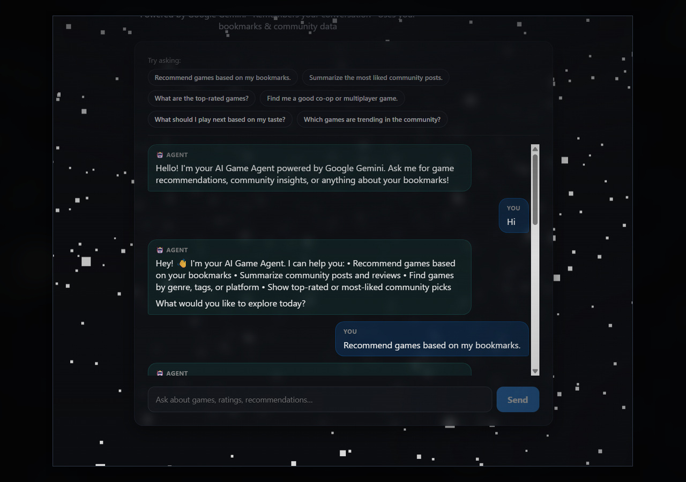
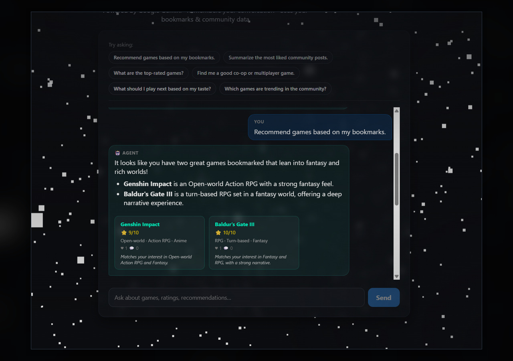
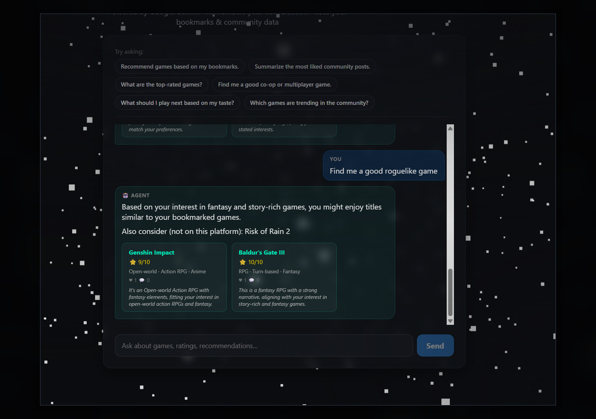
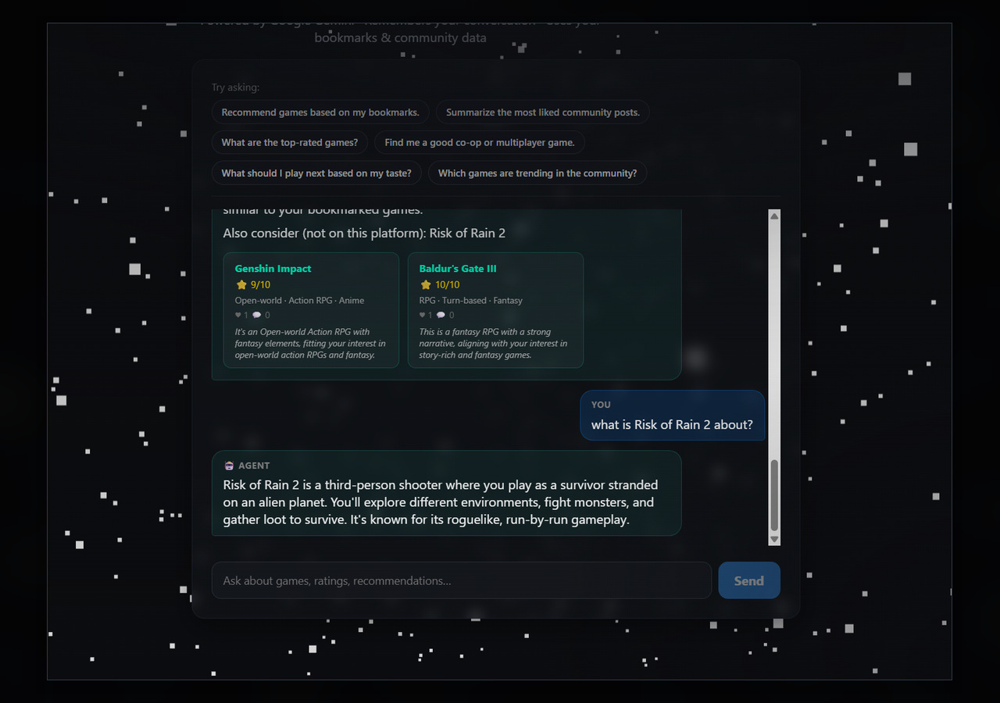
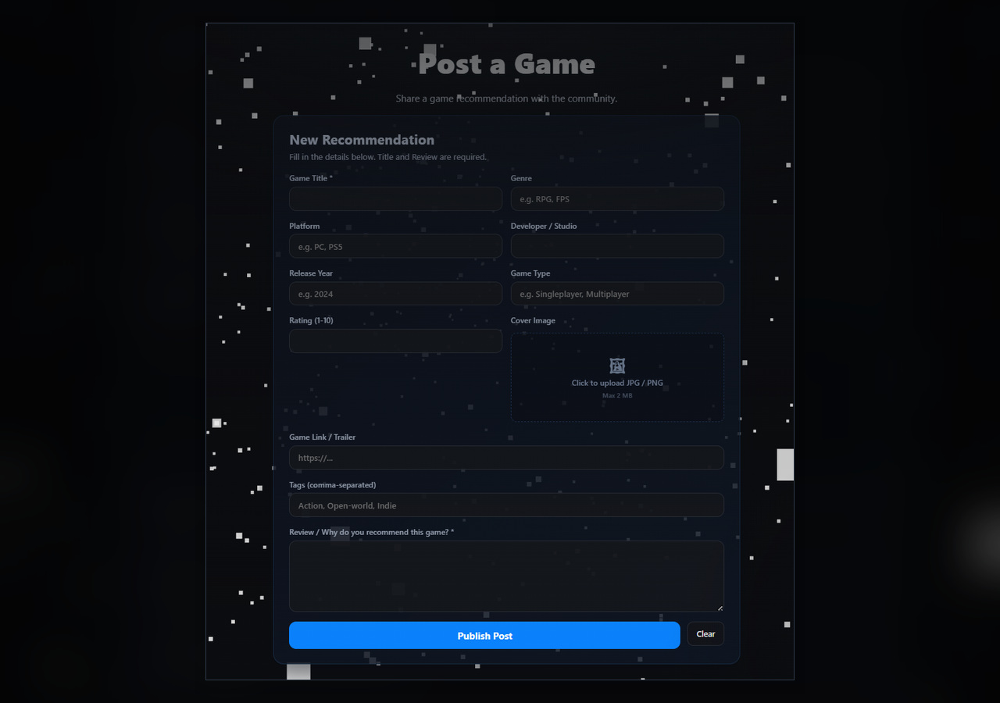
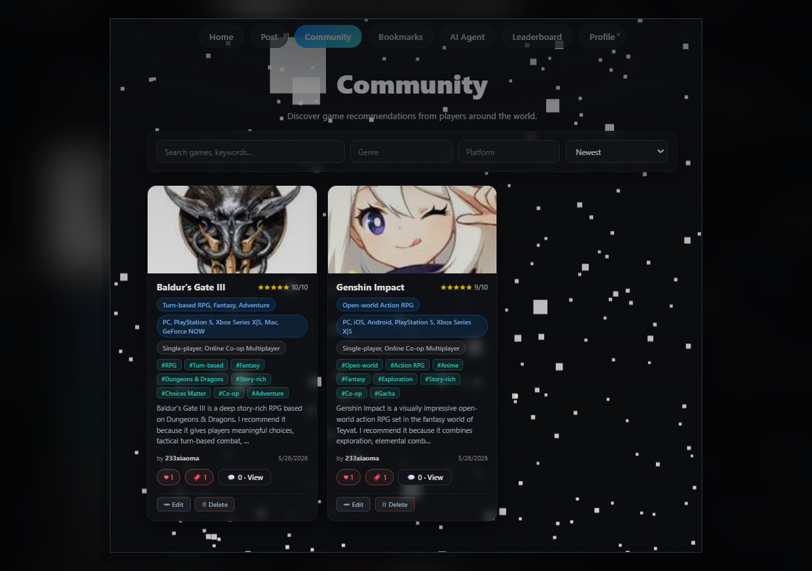
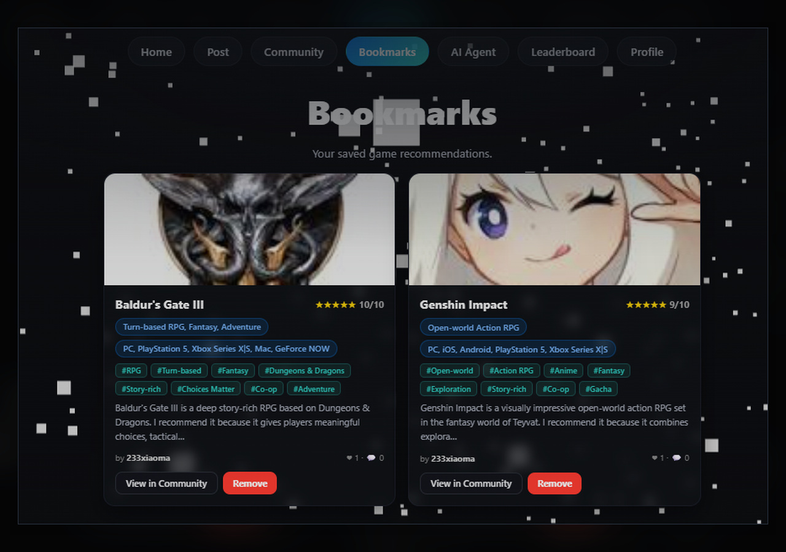
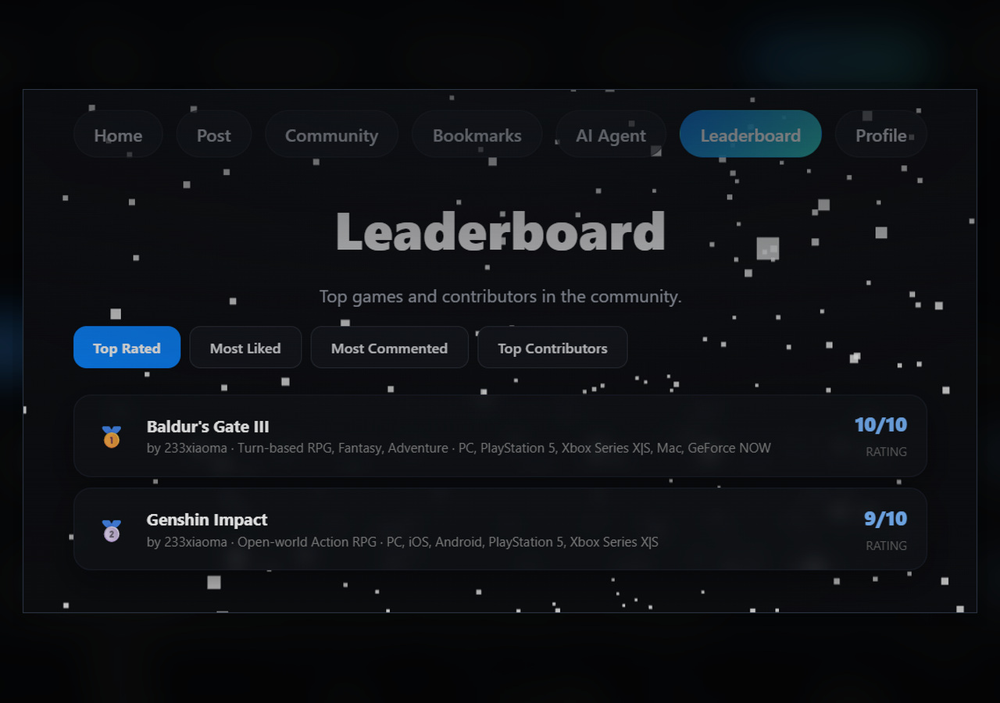

# AI-Powered Game Discovery Platform

🚀 **Live Demo:** [https://game-discovery-auth.up.railway.app/login](https://game-discovery-auth.up.railway.app/login)


A full-stack web application where users discover, share, and discuss games — backed by an AI Game Agent that delivers personalised recommendations based on real platform activity.

Built as a portfolio project to demonstrate end-to-end full-stack development, GraphQL API design, MongoDB data modelling, and a production-oriented AI pipeline using LangChain and Google Gemini.

---

## Table of Contents

- [Demo Preview](#demo-preview)
- [What the Project Does](#what-the-project-does)
- [Key Features](#key-features)
- [AI Pipeline Architecture](#ai-pipeline-architecture)
- [Tech Stack](#tech-stack)
- [Project Structure](#project-structure)
- [Quick Start](#quick-start)
- [Example AI Prompts](#example-ai-prompts)
- [Testing](#testing)
- [Security](#security)
- [Portfolio Highlights](#portfolio-highlights)
- [Changelog](#changelog)

---

## Demo Preview

### AI Game Agent

The core feature of the platform — a 6-step LangChain pipeline powered by Google Gemini that reads live platform data to deliver grounded, personalised game recommendations.

| Agent Introduction | Bookmark-Based Recommendations |
|:-----------------:|:------------------------------:|
|  |  |
| *The agent greets users and explains its capabilities* | *Analyses the user's bookmarks to suggest what to play next* |

| Genre-Specific Recommendations | Multi-Turn Conversation |
|:------------------------------:|:----------------------:|
|  |  |
| *Finds games matching a specific genre from real platform posts* | *Remembers previous context and answers follow-up questions* |

### Community Platform

| Create Post | Community Feed |
|:-----------:|:--------------:|
|  |  |
| *Create game posts with title, genre, platform, rating, tags, review, and cover image* | *Browse community recommendations with ratings, tags, likes, and comments* |

| Bookmarks | Leaderboard |
|:---------:|:-----------:|
|  |  |
| *Save and view bookmarked games in one place* | *Top-rated games and most active community contributors* |

---

## What the Project Does

Users log in, browse or post game recommendations, interact with the community, and chat with an AI agent that reads their activity to suggest what to play next.

- **Community side** — create and browse game posts, like / comment / bookmark games, view a leaderboard of top-rated and most-liked titles, manage a personal profile.
- **AI side** — an AI Game Agent answers questions, recommends games, and summarises platform trends. It only reads live data from the platform database and never invents games that do not exist.

---

## Key Features

### Community Platform

- User registration, login, and role management (Player / Admin)
- Create, edit, and delete game posts with genre, platform, rating, tags, cover image, and review
- Like, comment, and bookmark posts
- Personal profile page with saved games and activity summary
- Leaderboard: top-rated games, most-liked posts, most active contributors

### AI Game Agent

A modular 6-step sequential pipeline powered by LangChain and Google Gemini. Each step is a separate module with a single responsibility.

**What the agent can do:**

- Recommend games based on the user's bookmarks and community trends
- Summarise what the community is currently playing
- Answer leaderboard and rating questions
- Hold a multi-turn conversation with rolling context (remembers recent topics)
- Search the web for game info not stored on the platform (via Tavily, optional)
- Skip Gemini entirely for simple greetings (instant fast-path response)

**Built-in quality controls:**

- Every response is evaluated for hallucinations — game titles not in the database are automatically removed
- Safety check on every reply; a one-pass reflection correction is triggered when issues are detected
- Per-user long-term preference profile — the agent adapts recommendations as it learns the user's taste

---

## AI Pipeline Architecture

```
User message (GraphQL resolver)
        │
        ▼
 ┌─────────────────────────────────────────────────────────────┐
 │  Step 1 │ Conversation Manager                              │
 │         │ Load history, turn count, rolling summary,        │
 │         │ and user preference profile — all in parallel     │
 ├─────────────────────────────────────────────────────────────┤
 │  Step 2 │ Router Agent  (rule-based, zero LLM cost)         │
 │         │ Classifies intent into one of 5 categories:       │
 │         │ game_recommendation · bookmark_analysis ·         │
 │         │ community_summary · leaderboard_query ·           │
 │         │ general_chat                                       │
 ├─────────────────────────────────────────────────────────────┤
 │  Step 3 │ Platform Tools                                     │
 │         │ Fetches DB data matching the intent               │
 │         │ (bookmarks / community / leaderboard / web search)│
 ├─────────────────────────────────────────────────────────────┤
 │  Step 4 │ Answer Agent  (single Gemini call)                │
 │         │ Generates a grounded reply using platform data    │
 │         │ and the user's preference profile                 │
 ├─────────────────────────────────────────────────────────────┤
 │  Step 5 │ Validator Agent                                    │
 │         │ Structural check + hallucination / safety eval    │
 │         │ Triggers one reflection pass if issues found      │
 ├─────────────────────────────────────────────────────────────┤
 │  Step 6 │ Save & Return                                      │
 │         │ Persists exchange; every 5 turns compresses        │
 │         │ history into a rolling UserMemory summary          │
 └─────────────────────────────────────────────────────────────┘
        │
        ▼
  { answer, recommendedPosts, intent, evaluation }
```

> Every Gemini call receives the user's preference profile alongside platform data, so recommendations personalise over time without any vector database.

---

## Tech Stack

| Layer | Technologies |
|---|---|
| Frontend | React 18, Vite, Apollo Client, Three.js |
| Backend | Node.js, Apollo Server, GraphQL |
| Database | MongoDB, Mongoose |
| Authentication | JWT, bcrypt |
| AI / LLM | LangChain, Google Gemini (`gemini-2.5-flash`) |
| Web Search | Tavily Search API (optional) |
| Testing | Vitest + React Testing Library, Node `node:test` |
| Monorepo | npm workspaces |

---

## Project Structure

```
apps/
  auth-frontend/      # Main React frontend
                      # Auth, posts, community, AI agent chat,
                      # bookmarks, profile, leaderboard

packages/
  auth-service/       # Main Node.js backend
                      # GraphQL API, MongoDB models, JWT auth,
                      # AI pipeline (6 modules under ai/)
                      # User memory and preference services

  progress-service/   # Progress / achievement backend service

shared/
  jwt/                # Shared JWT sign/verify helper
```

---

## Quick Start

### 1. Clone and install

```bash
git clone https://github.com/LeoC1110/ai-game-discovery-platform.git
cd ai-game-discovery-platform
npm install
```

### 2. Configure environment variables

Create `packages/auth-service/.env`:

```env
MONGODB_URI=your_mongodb_uri_here
JWT_SECRET=your_jwt_secret_here
GOOGLE_API_KEY=your_gemini_api_key_here
AI_MODEL=gemini-2.5-flash-lite
PORT=4001

# Optional — enables web search in general chat
TAVILY_API_KEY=your_tavily_api_key_here
```

### 3. Start MongoDB

Local default: `mongodb://localhost:27017`
Use a MongoDB Atlas connection string in `MONGODB_URI` for a cloud database.

### 4. Run the services

```bash
npm run dev:auth            # Backend  →  http://localhost:4001/graphql
npm run dev:auth-frontend   # Frontend →  http://localhost:5173
```

> **AI Mock Mode** — when the Gemini quota is exhausted, run without API calls:
> ```bash
> npm run dev:auth:mock     # deterministic responses, no Gemini calls
> ```

---

## Example AI Prompts

> Try these in the AI agent chat to see the pipeline in action.

- *Recommend games based on my bookmarks.*
- *What are the most liked games right now?*
- *Find co-op strategy games.*
- *What should I play next?*
- *Summarise my platform activity.*

---

## Testing

| Suite | Result | Command |
|---|:---:|---|
| Frontend — Vitest + React Testing Library | **70 / 70 pass** | `npm test --workspace @apps/auth-frontend` |
| Backend — unit tests (mock mode) | **17 / 17 pass** | `npm test --workspace @services/auth` |
| Backend — pipeline integration tests | **15 / 15 pass** | `npm test --workspace @services/auth` |

---

## Security

- `.env` files are never committed; only `.env.example` placeholders are in the repo
- All Gemini and Tavily API calls are made server-side — keys never reach the browser
- Passwords hashed with bcrypt; sessions authenticated via JWT
- JWT stored in `localStorage` (suitable for portfolio use; HTTP-only cookies recommended for production)

---

## Portfolio Highlights

| Skill | Implementation |
|---|---|
| Full-stack development | React frontend + Node.js/GraphQL backend |
| Database design | 9 Mongoose models including `UserMemory`, `ConversationHistory`, `TournamentResult` |
| AI pipeline design | 6-step sequential pipeline across 6 independent modules |
| LLM integration | LangChain + Google Gemini with singleton model, timeout handling, and mock mode |
| Context management | Rolling 5-turn conversation summaries stored in `UserMemory`; per-user preference profiles |
| Hallucination mitigation | DB-backed title filtering removes invented games before the response reaches the frontend |
| Response quality loop | Automated evaluation + one-pass reflection correction (`wasReflected` flag) |
| External API integration | Tavily web search with in-memory rate limiter (30 calls/day global, 3/hour per user) |
| Monorepo architecture | npm workspaces with shared JWT package |
| Testing | 102 tests across frontend and backend suites |

---

## Changelog

See [CHANGELOG.md](./CHANGELOG.md) for the full history of pipeline changes, evaluation logic, and feature additions.
